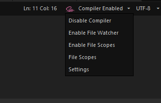
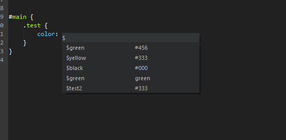
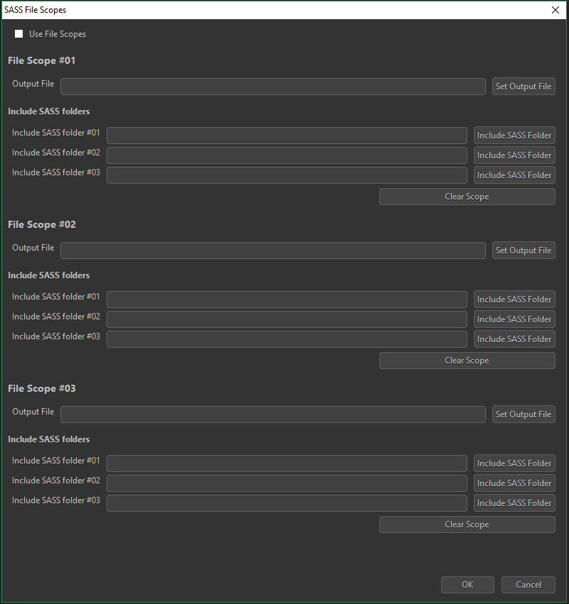

# Komodo-sass-compiler
Sass/Scss compiler for komodo edit/ide  
This addon allows you to compile SASS/SCSS files and will give auto completion on the $vars.

## Usage
If you install this addon. default the compiler is enabled.  
When you edit a SASS/SCSS file the file will be compiled to a CSS file.  
The addon lets you set up a *File Watcher* or multiple *File Scopes* so you can work with imports and multiple sass/scss files in one project or multiple open projects( max. 3 ).  
There are also some options available trough the menu.

### Menu options
**Tools > SASS > ...**
 * **Compile Saved File into CSS**  
Takes a .sass or .scss file and creates a .css file with the same name in the same spot as the .sass or .scss file.
 * **Compile Current Buffer (including imports)**  
 into CSS. Takes the contents of the current buffer and turns it into CSS.
 * **Compile Selection into CSS (including imports)**  
Takes the current selection and turns it into CSS
 * **Compile and Compress Saved File into CSS**  
 Takes a .sass or .scss file and creates a .css file with the same name in the same spot as the .sass or .scss file. The .sass or .scss file will be compressed/minified.
 * **Compile and Compress Current Buffer (including imports)**  
 into CSS. Takes the contents of the current buffer and turns it into compressed CSS.
 * **Compile and Compress Selection into CSS (including imports)**  
 takes the current selection and turns it into compressed CSS.
 * **Collect @vars**  
 collect all the SASS $vars for auto completion.
 * **File Watcher**
  * **Enable File Watcher for current file**  
  Enables a file watcher for current SASS file 
  * **disable File Watcher**  
  Disables the file watcher
 * **Sass Settings**  
 This will open the settings window.
 
 ### Statusbar
When editing Sass or scss files, a Sass statusbar will be shown.  
The statusbar well tell you, if the compiler is enabled/disabled, if a file watcher or file scope is active and it will show errors if present.  
  
Trough the statusbar you can easily configure the settings.
#### Statusbar options
 * **Disable Compiler**  
 This will disable the compiler
 * **Enable File Watcher**  
 This will enable a file watcher for the current file, when you edit sass or scss file's only the "Watched file" will be compiled
 * **File Scopes**  
 This will open a window where you can set file scopes, so you can work with multiple output files in one project or work with multiple projects.
 * **Settings**  
 This will open the settings window.
 
 
### Autocompletion
This addon will provide you with SASS or SCSS var auto completion.  
The vars will be search automatically( on file open and after you pressed $ on save ).  
You can also trigger the search trough the menu.  
When you type $ a auto completion box will be shown.  

### File Scopes
  
In the file scopes window, you can setup up to 3 file scopes.  
For each file scope you can set a output file( this file will be triggered if a sass or scss file is in the current scope ) and set up to 3 include folders.  
If a SASS or SCSS file is inside(recursively) a file scope, the selected output file will be compiled on save.
This allows you to work with multiple file scopes in one project or allows to work with multiple open projects( komodo windows )